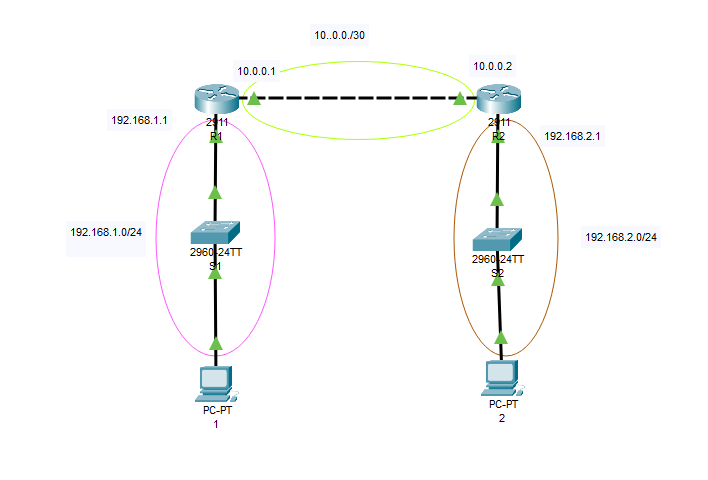
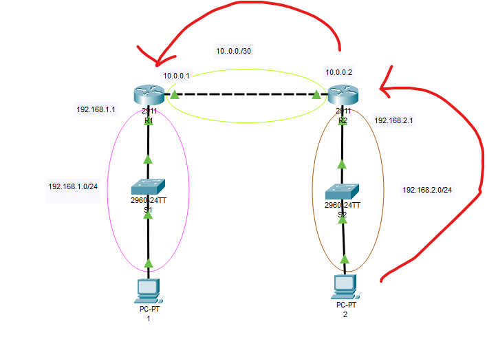

# DHCP+OSPF




**Router0**


```
enable
configure terminal
hostname R1
interface GigabitEthernet0/0
ip address 10.0.0.1 255.255.255.252
no shutdown 
interface GigabitEthernet0/1
ip address 192.168.1.1 255.255.255.0
no shutdown
```

**Router1**

```
enable
configure terminal
interface GigabitEthernet0/0
ip address 10.0.0.2 255.255.255.252
no shutdown
exit
interface GigabitEthernet0/1
ip address 192.168.2.1 255.255.255.0
no shutdown
exit
```

**PC1**
```
192.168.1.2
255.255.255.0
192.168.1.1
```

**PC2**
```
192.168.2.2
255.255.255.0
192.168.2.1
```

**OSPF**

**R1**
```
enable
configure terminal
router ospf 1
network 192.168.1.0 0.0.0.255 area 1
network 10.0.0.0 0.0.0.3 area 1
passive-interface GigabitEthernet0/1
exit
```

**R2**
```
enable
configure terminal
router ospf 1
network 192.168.2.0 0.0.0.255 area 1
network 10.0.0.0 0.0.0.3 area 1
passive-interface GigabitEthernet0/1
exit
```

**PC1**
```
C:\>ping 192.168.2.2

Pinging 192.168.2.2 with 32 bytes of data:

Reply from 192.168.2.2: bytes=32 time<1ms TTL=126
Reply from 192.168.2.2: bytes=32 time<1ms TTL=126
Reply from 192.168.2.2: bytes=32 time<1ms TTL=126
Reply from 192.168.2.2: bytes=32 time=4ms TTL=126

Ping statistics for 192.168.2.2:
    Packets: Sent = 4, Received = 4, Lost = 0 (0% loss),
Approximate round trip times in milli-seconds:
    Minimum = 0ms, Maximum = 4ms, Average = 1ms
    
```

**DHCP**



**R1**
```
ip dhcp pool r1
network 192.168.1.0 255.255.255.0
default-router 192.168.1.1
dns-server 9.9.9.9
```

**PC1**
```
Static---> DHCP
```

**New Pool for Network 192.168.2.0**

**R1**
```
ip dhcp pool r2
network 192.168.2.0 255.255.255.0
default-router 192.168.2.1
dns-server 9.9.9.9
exit
```

**R2**
```
enable
configure terminal
interface GigabitEthernet0/1
ip helper-address 10.0.0.1
exit
```


**Questions**

```
Why port g0/1? Because the DHCP request comes through here.
Why address 10.0.0.1? Because this is the address of the DHCP server.
Why dns-server? Only for training
Why 9.9.9.9? Because I like it.
Why did I use OSPF? Because it’s faster than static IP assignment, 
and at least we practiced DHCP with OSPF
```

**Task**
```
Configuring DHCP Excluded Addresses on a Cisco Router.
For both pools, exclude the range 2-100
```

<details>
<summary>Solution</summary>
    
**R1**

```
ip dhcp excluded-address 192.168.1.2 192.168.1.100
ip dhcp excluded-address 192.168.2.2 192.168.2.100
```

**PC1-PC2**

```
DHCP-->Static--->DHCP
```
**Test**
    
```
C:\>ping 192.168.1.101

Pinging 192.168.1.101 with 32 bytes of data:

Reply from 192.168.1.101: bytes=32 time<1ms TTL=126
Reply from 192.168.1.101: bytes=32 time<1ms TTL=126
Reply from 192.168.1.101: bytes=32 time<1ms TTL=126
Reply from 192.168.1.101: bytes=32 time=1ms TTL=126

Ping statistics for 192.168.1.101:
    Packets: Sent = 4, Received = 4, Lost = 0 (0% loss),
Approximate round trip times in milli-seconds:
    Minimum = 0ms, Maximum = 1ms, Average = 0ms
```
</details>


